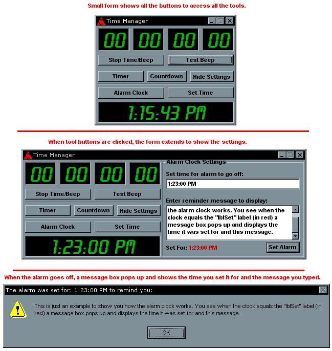



## Time Manager \(multiple time tools\)

### Description

It's three things in one:

1) Timer - To time something. Use it just like a stopwatch would work.

2) Countdown - Use this to limit something a certain amount of time.

3) Alarm Clock - Type in the time you want the alarm to go off, then type in a message you want it to say. When your computer reads that time you set it for a message box will pop up telling you what time it was set for and whatever your reminder is.
 
### More Info
 
For the countdown, if you want to set the count time for 1 minute, 1 hour, 1 day or anything like that, it get's all messed up. Instead of, lets say, setting it for 00:01:00:00 meaning 1 hour, set the time for: 00:00:59:59. For some reason the other way won't work so you have to change it a little, but it's still accurate (sort of).

             |
---                |---
**Submitted On**   |2002-06-20 13:00:40
**By**             |[Risket](https://github.com/Planet-Source-Code/PSCIndex/blob/master/ByAuthor/risket.md)
**Level**          |Beginner
**User Rating**    |3.4 (17 globes from 5 users)
**Compatibility**  |VB 6\.0
**Category**       |[Complete Applications](https://github.com/Planet-Source-Code/PSCIndex/blob/master/ByCategory/complete-applications__1-27.md)
**World**          |[Visual Basic](https://github.com/Planet-Source-Code/PSCIndex/blob/master/ByWorld/visual-basic.md)
**Archive File**   |[Time\_Manag970146202002\.zip](https://github.com/Planet-Source-Code/risket-time-manager-multiple-time-tools__1-36088/archive/master.zip)

